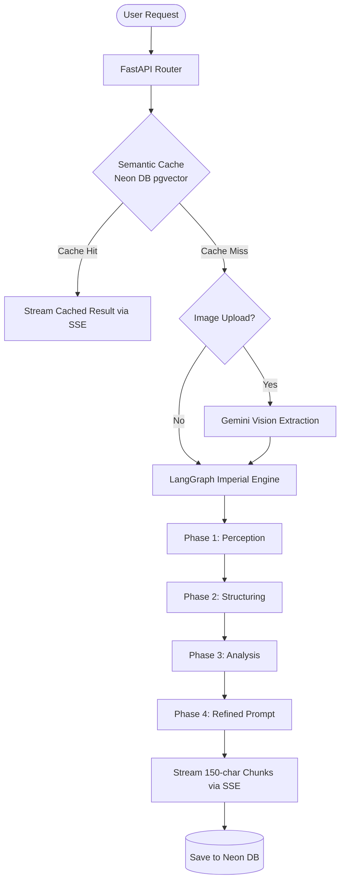

# PromptV (Neon Edition)

PromptV is a production-quality system for optimizing LLM prompts. It provides a pre-LLM optimization layer that refines, analyzes, and builds prompts for maximum performance, powered by Neon PostgreSQL 17.

## Features

- **SSE Streaming**: First token in <300ms.
- **Deterministic Scoring**: Instant quality feedback.
- **Semantic Cache**: Zero-latency for known intents (pgvector on Neon).
- **Image OCR**: Analyze debugging prompts from screenshots.
- **Version History**: Track prompt refinements over time.
- **Export**: Markdown, JSON, Cursor Rules, and Plain Text.

## Architecture Flow



## Tech Stack

- **Backend**: FastAPI, Pydantic v2, asyncpg, Gemini API.
- **Frontend**: React 18 (Vite), Tailwind CSS v3, Recharts.
- **Database**: Neon PostgreSQL 17 + pgvector.

## Getting Started

### 1. Database Setup
Run the contents of `neon_setup.sql` in your Neon SQL Editor.

### 2. Backend Setup
```bash
cd backend
python -m venv venv
source venv/bin/activate # or venv\Scripts\activate on Windows
pip install -r requirements.txt
cp ../.env.example .env
# Edit .env with your credentials
uvicorn main:app --reload
```

### 3. Frontend Setup
```bash
cd frontend
npm install
npm run dev
```

## Performance Optimization
- Pre-warmed connection pools.
- SSE score events sent before AI response.
- Compressed image uploads.
- Semantic similarity matching for cache hits.

